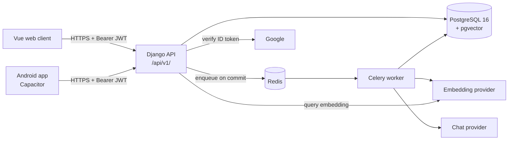

# Super Notes

Notes that sync across your devices, and **"Ask your notes"**: questions answered from your own
notes, with citations back to the notes the answer came from.

- **API:** Django 5.2 + Django REST Framework, JWT sessions, Google sign-in.
- **Search:** PostgreSQL full-text search plus pgvector similarity, merged with reciprocal rank
  fusion, always scoped to the owner in SQL.
- **Background work:** Celery + Redis (embedding notes, answering questions).
- **Clients:** Vue 3 + TipTap on the web; Android through Capacitor.

The build follows `docs/COMMIT_PLAN.md`; conventions come from the owner's expense tracker
(`docs/CONVENTIONS.md`).

## Architecture



## Native setup (Linux, no Docker)

Ubuntu 24.04 shown; any distro with PostgreSQL 16 and pgvector packages works.

```bash
# 1. System packages
sudo apt install -y postgresql-16 postgresql-16-pgvector redis-server python3-venv

# 2. A database role and database. Superuser, because CREATE EXTENSION vector
#    (run by a migration, not by hand) needs it.
sudo -u postgres createuser --superuser "$USER"
createdb super_notes

# 3. Python environment
python3 -m venv .venv
source .venv/bin/activate
pip install -r requirements.txt -r requirements-dev.txt
pre-commit install

# 4. Configuration
cp .env.example .env
#    set SECRET_KEY, and DATABASE_URL=postgres://$USER@127.0.0.1:5432/super_notes
#    (or postgres:///super_notes to use the local socket)

# 5. Database (also enables pgvector)
python manage.py migrate
python manage.py createsuperuser   # for /admin/

# 6. Run: three terminals
uvicorn config.asgi:application --reload --port 8000   # or: python manage.py runserver
celery -A config worker -l info
cd web && npm install && npm run dev      # cp web/.env.example web/.env.local first
```

`uvicorn` (ASGI) serves everything `runserver` does, static files included while `DEBUG` is on,
and also streams answers live (`GET ask/<id>/stream/`). Under `runserver` (WSGI) that endpoint
answers from the saved row only and says `unavailable`, and the web client polls instead; every
other endpoint is the same under both. Live answers need the worker and the API to share a Redis:
`ASK_EVENTS_REDIS_URL`, which defaults to `CELERY_BROKER_URL`.

API docs: <http://localhost:8000/api/v1/docs/> · Schema: `/api/v1/schema/` · Health:
`/api/v1/health/`.

## API at a glance

All under `/api/v1/`, `Authorization: Bearer <access>`, errors as `{"detail", "code"}`.

| Area | Endpoints |
|---|---|
| Auth | `POST auth/google/` `{id_token}`, `POST auth/refresh/`, `POST auth/logout/`, `GET me/` (plan and this month's ask usage), `GET auth/devices/`, `DELETE auth/devices/<id>/` |
| Notes | `GET/POST notes/`, `GET/PATCH/DELETE notes/<id>/` (PATCH needs `version`; stale → `409 version_conflict`), `GET notes/changes/?after=<revision>` |
| Search | `GET search/?q=&k=` — hybrid (vector + keyword, RRF), your notes only |
| Ask | `POST ask/` with an `Idempotency-Key` header → `202`, then poll `GET ask/<id>/` or stream `GET ask/<id>/stream/` (server-sent events, under uvicorn); `GET ask/` for history; over quota → `429 quota_exceeded` |

## Deploying: notes for the streaming endpoint

Serve the API with uvicorn behind the reverse proxy, e.g.
`uvicorn config.asgi:application --host 127.0.0.1 --port 8000 --workers 4 --proxy-headers`
(`DEBUG` off; static files are the proxy's job). Every endpoint works there; only
`GET ask/<id>/stream/` needs it. For that path the proxy must not buffer the response (the app
sends `X-Accel-Buffering: no`, which nginx honours; others need `proxy_buffering off` or the
like) and must allow at least 30 s between bytes (a keep-alive comment comes every 15 s). Each
open stream holds one Redis connection for at most `ASK_STREAM_MAX_SECONDS` (5 minutes), and no
database connection between its reads of the row; a user may have `STREAM_MAX_PER_USER` (3) open
at once. Size Redis' `maxclients` and the proxy's connection limits for the streams you expect. The hosting
target itself is still an open question (`docs/V2_PLAN.md`).

**Request body limit.** Set the proxy's body limit to about **10.1 MB**
(`ATTACHMENT_MAX_BYTES`, 10 MB, plus 64 KB for the multipart envelope), e.g. nginx
`client_max_body_size 10400k;`. The app checks `Content-Length` and counts an upload's bytes as
it parses them, but under uvicorn the whole body is read before the app sees it, so only the proxy
can stop a body that lies about its length, or has none, before it is read in full. If you raise
`ATTACHMENT_MAX_BYTES`, raise the proxy's limit with it.

## Turning on the real services

Everything runs on deterministic **fake** AI providers until you configure real ones, and Google
sign-in is off until a client id is set.

1. **Google sign-in.** In Google Cloud Console create an OAuth *web* client, add
   `http://localhost:5173` as an authorised JavaScript origin, then set its id in both
   `GOOGLE_OAUTH_CLIENT_IDS` (`.env`) and `VITE_GOOGLE_CLIENT_ID` (`web/.env.local`). The Android
   client id is added to the same backend list in phase 7.
2. **AI providers** (`.env`). Pick one embedding and one chat provider; each reads its vendor's
   own key variable:

   ```bash
   EMBEDDING_PROVIDER=openai        # or gemini            (fake by default)
   CHAT_PROVIDER=claude             # or openai, gemini    (fake by default)
   OPENAI_API_KEY=...  GEMINI_API_KEY=...  ANTHROPIC_API_KEY=...
   ```

   Changing the embedding provider or model means re-embedding:
   `python manage.py reindex_notes --all`, then `python manage.py index_status` to watch it.
3. **Measure, then set the relevance floor.** `python manage.py eval_retrieval --k 5 --by-kind`
   prints recall@5 and MRR for vector, keyword and hybrid search, and the top similarity of the
   questions that have no answer. Record the numbers in `docs/RAG.md` and set
   `ASK_RELEVANCE_FLOOR` between the no-answer and the answerable similarities (it is `0.0`
   until then, so only an empty search skips the model).

## Tests

```bash
python manage.py test                 # Django's runner, against Postgres
coverage run manage.py test && coverage report
ruff check . && ruff format --check .
python manage.py makemigrations --check --dry-run
python manage.py spectacular --file docs/openapi.yml --validate --fail-on-warn
```

The suite needs no API keys and no running worker: Celery runs eagerly and the embedding and chat
providers are the deterministic `fake` ones (`config/test_runner.py`). The few tests that call a
real vendor run only with `LIVE_PROVIDER_TESTS=1` *and* that vendor's key set.

The web client type-checks and builds with `cd web && npm run build` (CI does the same).

## Retrieval evaluation

30 fixture notes and 31 labelled questions (`retrieval/eval/fixtures/`), scored per note.

| Provider | Mode | recall@5 | MRR |
|---|---|---|---|
| fake (smoke test, not a quality measure) | vector | 0.625 | 0.587 |
| | keyword | 0.839 | 0.744 |
| | hybrid | 0.804 | 0.703 |
| real provider | all | pending an API key | |

## Docs

| File | What |
|---|---|
| `docs/architecture.html` | Open in a browser: component map, workflows, data model |
| `docs/RAG.md` | Chunking, indexing, retrieval, asking, evaluation, known limits |
| `docs/openapi.yml` | The API contract (CI fails if it drifts from the code) |
| `docs/CONVENTIONS.md` | What was carried over from the reference, and why |
| `docs/COMMIT_PLAN.md` | Phases and their status |
| `docs/DECISIONS.md` | Every judgement call, with the alternative |
| `docs/BUILD_LOG.md` | What each phase took and what went wrong |
| `docs/BACKLOG.md` | Out of scope, and parked questions |
| `docs/research/memory-tools.html` | supermemory and codebase-memory-mcp, and what they mean here |
| `SECURITY.md` | Reporting, and dependency-fix time frames |
