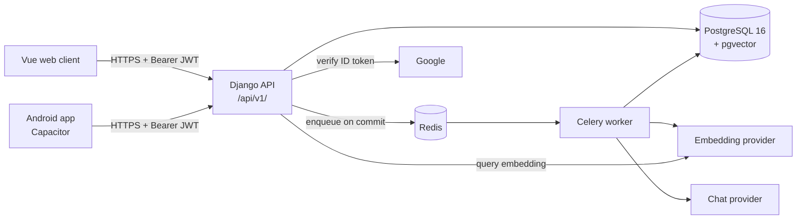

# Super Notes

Notes that sync across your devices, and **"Ask your notes"**: questions answered from your own
notes, with citations back to the notes the answer came from.

- **API:** Django 5.2 + Django REST Framework, JWT sessions, Google sign-in.
- **Search:** PostgreSQL full-text search plus pgvector similarity, merged with reciprocal rank
  fusion, always scoped to the owner in SQL.
- **Background work:** Celery + Redis (embedding notes, answering questions).
- **Clients:** Vue 3 + TipTap on the web; Android through Capacitor.

The build follows `docs/COMMIT_PLAN.md`; conventions come from the owner's expense tracker
(`docs/CONVENTIONS.md`).

## Architecture



## Native setup (Linux, no Docker)

Ubuntu 24.04 shown; any distro with PostgreSQL 16 and pgvector packages works.

```bash
# 1. System packages
sudo apt install -y postgresql-16 postgresql-16-pgvector redis-server python3-venv

# 2. A database role and database. Superuser, because CREATE EXTENSION vector
#    (run by a migration, not by hand) needs it.
sudo -u postgres createuser --superuser "$USER"
createdb super_notes

# 3. Python environment
python3 -m venv .venv
source .venv/bin/activate
pip install -r requirements.txt -r requirements-dev.txt
pre-commit install

# 4. Configuration
cp .env.example .env
#    set SECRET_KEY, and DATABASE_URL=postgres://$USER@127.0.0.1:5432/super_notes
#    (or postgres:///super_notes to use the local socket)

# 5. Database (also enables pgvector)
python manage.py migrate
python manage.py createsuperuser   # for /admin/

# 6. Run: three terminals
python manage.py runserver
celery -A config worker -l info
cd web && npm install && npm run dev      # from phase 6
```

API docs: <http://localhost:8000/api/v1/docs/> · Schema: `/api/v1/schema/` · Health:
`/api/v1/health/`.

## Tests

```bash
python manage.py test                 # Django's runner, against Postgres
coverage run manage.py test && coverage report
ruff check . && ruff format --check .
python manage.py makemigrations --check --dry-run
python manage.py spectacular --file docs/openapi.yml --validate --fail-on-warn
```

The suite needs no API keys and no running worker: Celery runs eagerly and the embedding and chat
providers are the deterministic `fake` ones (`config/test_runner.py`).

## Docs

| File | What |
|---|---|
| `docs/CONVENTIONS.md` | What was carried over from the reference, and why |
| `docs/COMMIT_PLAN.md` | Phases and their status |
| `docs/DECISIONS.md` | Every judgement call, with the alternative |
| `docs/BUILD_LOG.md` | What each phase took and what went wrong |
| `docs/BACKLOG.md` | Out of scope, and parked questions |
| `SECURITY.md` | Reporting, and dependency-fix time frames |
